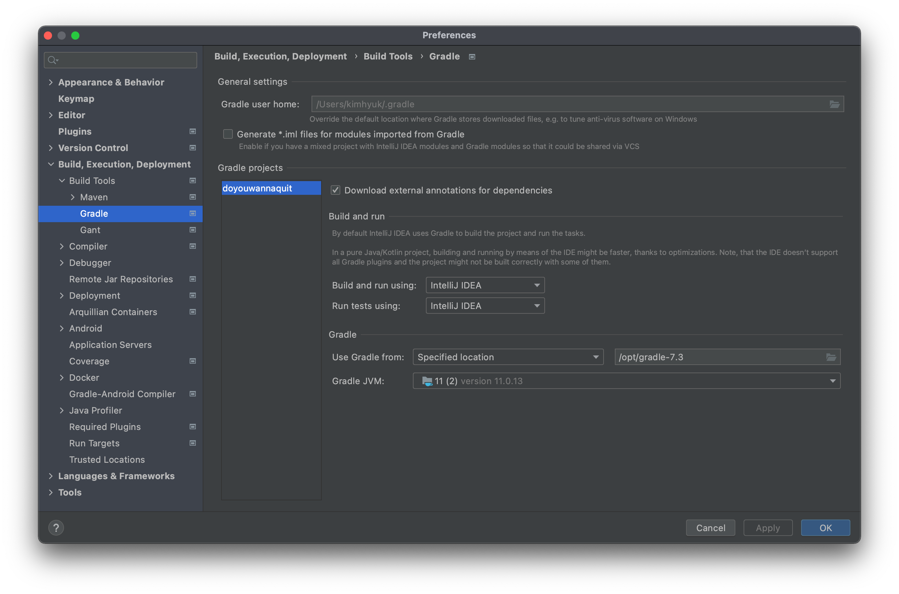

## 초기 세팅

---

### 1. Vue

```bash
npm install
```

#### prettier 설정

> node_modules에 있는 prettier 경로로 셋팅
> 

#### 단축키 변경

> keymap에 Plugins에 접근 후 Prettier를 아래와 같이 셋팅
> 

<br>

### 2. SpringBoot

#### Gradle

> 빌드 intellij로 변경
> 

<br>

#### Annotation

> 상단 Enable 체크하기
> 
